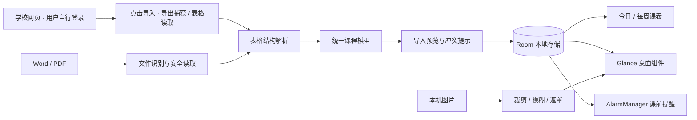

# 中大课表助手
华为鸿蒙系组件开发中 
iphone用户尚无法正常使用
其他安卓用户均可尝试，如有问题欢迎通过 github issues 留言

# iPhone / 网页版 (仍然内测中，尚不可用)

**[打开中大课表网页版](https://xiaoyle.github.io/CampusSchedule/)** · xiaoyle 制作

Safari 访问 → 添加到主屏幕 → 从图标打开 → 导入 Word / PDF 或粘贴快捷指令课表 → 预览确认。已保存课表可离线查看。

[网页版使用、开发与隐私说明](web/README.md) · [学校快捷指令配置教程](https://xiaoyle.github.io/CampusSchedule/shortcut-guide.html)

iPhone 安装及真实学校快捷指令流程待真机验证。网页版不包含安卓后台闹铃或原生桌面组件。以下为安卓版本说明。

# 安卓版说明
<p align="center">
  
</p>

<p align="center">
  面向中山大学学生的本地安卓课表工具<br>
  网页 / Word / PDF 导入 · 桌面组件 · 课前提醒 · 自定义图片背景
</p>

<p align="center">
  
  
  
  
</p>

> **xiaoyle 制作** · 非中山大学官方应用 · 当前为同学试用版

## 为什么做这个项目

学校课表需要经过统一门户和教务系统才能查看，在手机桌面上无法快速看到下一节课。中大课表助手将电脑导出的课表还原为结构化课程，在桌面直接显示时间、课程和教室，并在课前提醒。

所有课程、个人资料和自选图片只保存在手机本机。应用没有注册、广告、统计分析、服务器或云同步；网络权限仅用于学校网页及其引用的认证、验证码等资源，登录由学校处理。

## 功能

- 应用内登录学校网页，进入课表查询、选择全部周次，点击底部“导入当前课表”，核对后保存；真实登录与二次验证仍待真机验证。

- 导入教务系统导出的 Word 或文字 PDF，预览确认后保存；解析失败不覆盖原课表。
- 解析星期、周次、连续节次、教师和候选教室，保留真实课程冲突与待确认信息。
- 提供“下一节课”“今日课程”和“学习看板”三种可缩放桌面组件。
- 支持提前 5、10、15、30 分钟提醒，以及最长 1 分钟的持续闹铃。
- 支持单次课程取消、改时间、改地点和恢复原安排。
- 自建课程支持“仅这一次”或每周重复 2–30 次；可按“仅本次／本次及以后／整个系列”修改和删除，并逐周检查冲突。
- 添加课程可复用最近 5 个自建课程模板；系列中的每一次都会同步到今日、日历、组件和课前提醒。
- 新增课业待办，可关联课程并记录作业、考试、复习和其他任务；支持优先级、截止时间、单次提醒、完成、复制和撤销。
- 支持每日、每周和自选星期重复任务，每次完成状态互不影响；任务可拆成可排序的检查清单。
- 课表页可切换周课表与学习月历，在同一天的时间轴中统一查看课程和截止任务。
- 待办支持搜索及类型、优先级、课程筛选；日期和时间可直接使用系统选择器。
- 今日首页显示教学周进度、上课倒计时、课程与待办统计；个人中心显示本周学习概览。
- 今日首页提供下一步建议和未来七天负荷，个人中心可设置每周目标并查看连续进展天数。
- 今日页新增“空档雷达”，在课程前后预留 10 分钟后扫描至 23:00，并按预计用时和紧急程度推荐可放入空档的待办。
- 修复系统返回键：页面逐级返回，首页连续按两次才退出；主页面保留滚动位置并使用轻量切换动画。
- 学习看板按桌面尺寸显示最近 2／3／4 项待办，每项可直接打开或完成。
- 支持 25、45、60 分钟及自定义倒计时、最长 12 小时正计时；全屏校园昼夜光轨显示进度，锁屏通知可暂停、继续和结束。
- 内置程序生成的檐下雨声、珠海海浪和静谧图书馆环境音；专注记录自动汇总为本周、上周和最近四周复盘。
- 新增成就馆：5 枚原创校园珐琅徽章、解锁进度、最多 3 枚精选展示，以及最多 50 个自定义成就和徽章编辑器。
- 主导航精简为“今日、计划、我的”；日历、待办、设置、个性化和资料均保留在对应入口中。
- 三个桌面组件都支持独立的照片卡、毛玻璃、课程便签 DIY，可调裁剪、模糊、透明度、标题、字号和点缀色；收藏搭配可应用到任意组件。
- 新增个人中心，可保存头像、昵称、问候语及可选校园资料；头像可显示在组件右下角。
- 个人中心提供动漫二次元、末世绝境、科技赛博朋克、温馨风景四组原创离线轮播，每组 3 张无人风景；按北京时间每日轮换，也可手动滑动。
- 支持康乐园绿、珠海海蓝和四季自动配色；课程可选择自己的颜色。
- 普通图标启动时可长按未来芯核充能进入；内置三套原创场景，芯核支持五种预设、自定义主色与光环色、透明度和光效强度，也可使用自己的照片。
- 图片通过系统选择器导入并压缩到本机私有目录；最多收藏 8 套桌面搭配。

## 下载与使用

前往仓库右侧 **Releases**，打开 `v0.10.0`，在 **Assets** 中下载 `CampusSchedule-0.10.0.apk`。GitHub 自动生成的 Source code 不是安装包。

1. 安装 APK。若旧版本签名一致，可直接覆盖更新。
2. 在“导入与设置”中确认第一教学周周一，点击“从学校网页导入”，自行登录和二次验证。
3. 进入“课表查询”，选择学期和“全部”周次，点击底部“导入当前课表”，核对预览并确认保存。网页不可用时，将电脑导出的 Word 或文字 PDF 保存到手机“下载”文件夹，使用文件导入。
4. 检查通知、准时提醒和电池设置，再添加桌面组件。
5. 进入“桌面 DIY”，选择背景和样式，点击“保存到桌面”。
6. 在“我的”中设置头像、校园配色、启动场景和精选成就；在“计划”中管理日历、课程和待办。
7. 从今日页点击“开始专注”，选择时间、目标和环境音；专注结束后再决定是否完成关联任务。

默认第一教学周周一为 `2026-09-07`，默认提前 10 分钟提醒；每次导入都可以修改日期。

## 核心实现



项目将课程解析和日期计算放在独立 `core` 模块，安卓模块负责文件读取、界面、本地存储、组件和通知。Word 解析会还原横向与纵向合并单元格；PDF 解析结合文字坐标和表格线条重建跨页课表。课程模型统一服务于预览、课表页面、桌面组件和提醒，避免多处各自解释课表。

| 模块 | 技术与职责 |
|---|---|
| `core` | Kotlin/JVM；课表解析、课程与重复任务计算、专注计时、复盘统计和成就规则 |
| `app` | Kotlin、Jetpack Compose、Room、Jetpack Glance、AlarmManager、WorkManager、前台媒体服务 |
| 桌面 DIY | 系统文件选择器、受限图片解码、共享背景渲染、Glance 自适应布局 |
| 隐私 | 本地存储、关闭备份、无应用账号与后端；网页登录会话可手动清除，不读取账号、密码和验证码 |

更完整的技术说明见 [项目架构](docs/ARCHITECTURE.md)，实际验证范围见 [验证记录](VERIFICATION.md)。

## 本地构建

需要 JDK 17、Android SDK 35 和网络连接以下载 Gradle 依赖。

```powershell
# Windows
./gradlew.bat :core:test :app:assembleDebug :app:lintDebug
```

```bash
# macOS / Linux
./gradlew :core:test :app:assembleDebug :app:lintDebug
```

APK 输出位置为 `app/build/outputs/apk/debug/app-debug.apk`。真实课表测试样本位于本地 `private-fixtures`，不会进入 GitHub；缺少这些私有样本时，相应测试会跳过。

## 兼容性与限制

- 最低 Android 8.0（API 26），compile/target SDK 35；厂商后台策略可能影响提醒时间。
- 支持学校导出的 Word、带文字和完整表格边框的 PDF；扫描件、加密文件和旋转页面暂不支持。
- 不自动推测节假日停课，临时调课由用户修改。
- 原生 HarmonyOS 5 / 6 / NEXT 通过卓易通运行时，安卓组件通常不能显示在鸿蒙桌面；当前没有原生鸿蒙卡片版。
- 普通 Android 桌面组件不支持稳定播放视频、GIF 或实况照片；内置场景在组件中显示静态海报，在启动页中显示轻量动态效果。
- 0.10.0 的组件尺寸、轮播视觉、空档推荐、锁屏计时与多品牌真机效果由试用反馈继续验证。学校改版或限制 WebView 时可退回文件导入。


# 中大课表助手 HarmonyOS 原生版(新增，仍在内测中)

这是“中大课表助手”的 HarmonyOS 5/6 原生工程，使用 ArkTS、ArkUI Stage 模型和 Form Kit 服务卡片。项目由 **xiaoyle** 制作。

## 已实现

- 导入中山大学教务系统导出的文字 PDF，全程本机解析。
- 设置第一教学周周一，导入前预览，失败不覆盖旧课表。
- 今日页面显示下一节课和当天课程。
- 本机学习待办：添加、完成、恢复、删除。
- 三张原生服务卡片：下一节课、今日课程、学习看板。
- 课表和待办保存后主动刷新卡片，卡片也支持手动刷新。

## 在 DevEco Studio 运行

1. 用 DevEco Studio 打开 `D:\HarmonyOS`，等待 Sync 完成。
2. 用数据线连接 HarmonyOS 5/6 手机，开启开发者模式和 USB 调试。
3. 打开 `File > Project Structure > Project > Signing Configs`。
4. 勾选或点击 `Automatically generate signature`，确认已登录的华为开发者账号与当前设备。
5. 选择手机为运行目标，点击 Run。DevEco 会使用调试证书构建并安装。
6. 安装后长按应用图标，进入“服务卡片”，选择三种卡片之一添加到桌面。

自动签名生成的证书和设备调试授权与开发者账号、设备相关，不应提交到 GitHub。官方说明：[自动签名](https://developer.huawei.com/consumer/cn/doc/HarmonyOS-Guides/ide-signing-auto)、[创建服务卡片](https://developer.huawei.com/consumer/cn/doc/HarmonyOS-Guides/ide-service-widget)。

## 命令行构建

在 PowerShell 运行：

```powershell
./build-hap.ps1
```

未配置签名时会生成：

`entry/build/default/outputs/default/entry-default-unsigned.hap`

未签名 HAP 用于确认工程可以编译，不能直接安装到普通真机。真机调试请按上面的 DevEco 自动签名流程运行。

## PDF 解析器

解析器已作为离线 HTML 打包到 `entry/src/main/resources/rawfile/pdf/parser.html`。如需重新生成：

```powershell
cd pdf-web
npm install
npm run build
```

## 当前范围

- 原生首版支持学校导出的文字 PDF；扫描件和截图尚不支持。
- 这是独立 HarmonyOS 数据库，暂未与 Android 版自动同步。
- 真机签名、安装与服务卡片添加需要在开发者账号绑定的设备上完成。

## 文档

- [0.10.0 发布说明](docs/RELEASE-v0.10.0.md)
- [内置校园照片来源](docs/PHOTO-CREDITS.md)
- [数据与隐私说明](docs/PRIVACY.md)
- [项目架构](docs/ARCHITECTURE.md)
- [贡献与反馈](CONTRIBUTING.md)
- [版本记录](CHANGELOG.md)
- [GitHub 发布教程](docs/GITHUB-PUBLISH.md)
- [简历与面试素材](docs/PORTFOLIO.md)

## 项目状态与许可

本项目仍处于个人维护和同学试用阶段。欢迎提交已脱敏的问题反馈；请勿公开上传账号、验证码、学号、原始个人课表或含个人信息的截图。

当前仓库尚未指定源码许可证。源码公开可见不代表允许复制、修改或再次分发；项目依赖及 Gradle Wrapper 保留各自许可证。
