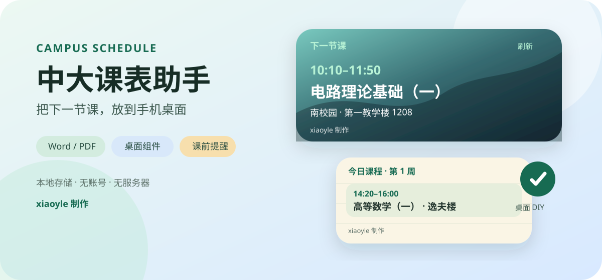
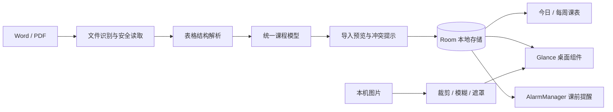

# 中大课表助手

<p align="center">
  
</p>

<p align="center">
  面向中山大学学生的本地安卓课表工具<br>
  Word / PDF 导入 · 桌面组件 · 课前提醒 · 自定义图片背景
</p>

<p align="center">
  
  
  
  
</p>

> **xiaoyle 制作** · 非中山大学官方应用 · 当前为同学试用版

## 为什么做这个项目

学校课表需要经过统一门户和教务系统才能查看，在手机桌面上无法快速看到下一节课。中大课表助手将电脑导出的课表还原为结构化课程，在桌面直接显示时间、课程和教室，并在课前提醒。

所有课程和自选图片只保存在手机本机。应用没有注册、广告、统计分析、服务器或云同步，当前版本也不申请网络权限。

## 功能

- 导入教务系统导出的 Word 或文字 PDF，预览确认后保存；解析失败不覆盖原课表。
- 解析星期、周次、连续节次、教师和候选教室，保留真实课程冲突与待确认信息。
- 提供“下一节课”和“今日课程”两种可缩放桌面组件。
- 支持提前 5、10、15、30 分钟提醒，以及最长 1 分钟的持续闹铃。
- 支持单次课程取消、改时间、改地点和恢复原安排。
- 支持照片卡、毛玻璃、课程便签三种 DIY 外观，可调裁剪、模糊、透明度、标题、字号和点缀色。
- 图片通过系统选择器导入并压缩到本机私有目录；最多收藏 8 套桌面搭配。

## 下载与使用

前往仓库右侧 **Releases**，打开 `v0.3.0`，在 **Assets** 中下载 `CampusSchedule-0.3.0.apk`。GitHub 自动生成的 Source code 不是安装包。

1. 安装 APK。若旧版本签名一致，可直接覆盖更新。
2. 在电脑教务系统导出全部周次的 Word 或文字 PDF，并保存到手机“下载”文件夹。
3. 打开应用，在“导入与设置”中确认第一教学周周一，选择文件并核对预览。
4. 检查通知、准时提醒和电池设置，再添加桌面组件。
5. 进入“桌面 DIY”，选择背景和样式，点击“保存到桌面”。

默认第一教学周周一为 `2026-09-07`，默认提前 10 分钟提醒；每次导入都可以修改日期。

## 核心实现



项目将课程解析和日期计算放在独立 `core` 模块，安卓模块负责文件读取、界面、本地存储、组件和通知。Word 解析会还原横向与纵向合并单元格；PDF 解析结合文字坐标和表格线条重建跨页课表。课程模型统一服务于预览、课表页面、桌面组件和提醒，避免多处各自解释课表。

| 模块 | 技术与职责 |
|---|---|
| `core` | Kotlin/JVM；Word XML、PDF 几何解析、周次与课程计算、冲突与导入差异 |
| `app` | Kotlin、Jetpack Compose、Room、Jetpack Glance、AlarmManager、WorkManager |
| 桌面 DIY | 系统文件选择器、受限图片解码、共享背景渲染、Glance 自适应布局 |
| 隐私 | 本地存储、关闭备份、无账号与后端、安装包不声明网络权限 |

更完整的技术说明见 [项目架构](docs/ARCHITECTURE.md)，实际验证范围见 [验证记录](VERIFICATION.md)。

## 本地构建

需要 JDK 17、Android SDK 35 和网络连接以下载 Gradle 依赖。

```powershell
# Windows
./gradlew.bat :core:test :app:assembleDebug :app:lintDebug
```

```bash
# macOS / Linux
./gradlew :core:test :app:assembleDebug :app:lintDebug
```

APK 输出位置为 `app/build/outputs/apk/debug/app-debug.apk`。真实课表测试样本位于本地 `private-fixtures`，不会进入 GitHub；缺少这些私有样本时，相应测试会跳过。

## 兼容性与限制

- 最低 Android 8.0（API 26），compile/target SDK 35；厂商后台策略可能影响提醒时间。
- 支持学校导出的 Word、带文字和完整表格边框的 PDF；扫描件、加密文件和旋转页面暂不支持。
- 不自动推测节假日停课，临时调课由用户修改。
- 原生 HarmonyOS 5 / 6 / NEXT 通过卓易通运行时，安卓组件通常不能显示在鸿蒙桌面；当前没有原生鸿蒙卡片版。
- 0.3.0 的 DIY 真机效果仍在收集反馈，发布时建议标记为 Pre-release。

## 文档

- [0.3.0 发布说明](docs/RELEASE-v0.3.0.md)
- [数据与隐私说明](docs/PRIVACY.md)
- [项目架构](docs/ARCHITECTURE.md)
- [贡献与反馈](CONTRIBUTING.md)
- [版本记录](CHANGELOG.md)
- [GitHub 发布教程](docs/GITHUB-PUBLISH.md)
- [简历与面试素材](docs/PORTFOLIO.md)

## 项目状态与许可

本项目仍处于个人维护和同学试用阶段。欢迎提交已脱敏的问题反馈；请勿公开上传账号、验证码、学号、原始个人课表或含个人信息的截图。

当前仓库尚未指定源码许可证。源码公开可见不代表允许复制、修改或再次分发；项目依赖及 Gradle Wrapper 保留各自许可证。
